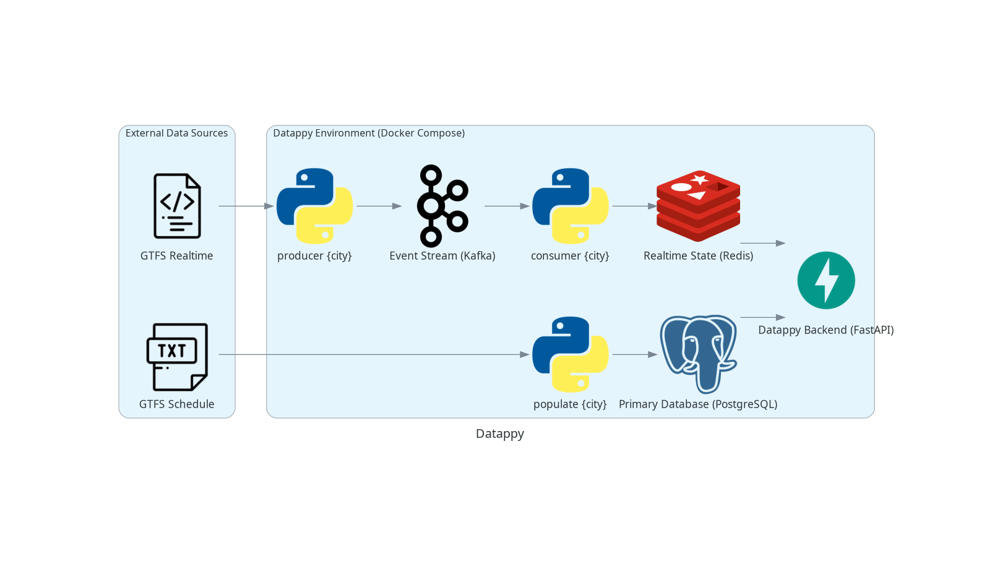

# 🚌 Datappy — Affichage Temps Réel des Transports en Commun

**Datappy** fournit une **application mobile** permettant de visualiser, à la manière des panneaux d'affichage physiques, les **prochains départs en temps réel** d'un arrêt de transport en commun. Le projet exploite les flux **GTFS** (statique) et **GTFS-RT** (temps réel) publiés sur [transport.data.gouv.fr](https://transport.data.gouv.fr).

## 🎯 Objectif

* **Panneaux d'affichage numériques** : visualisation des prochains départs pour un arrêt et une direction donnés.
* **Temps réel** : les départs sont mis à jour en direct via WebSocket, à partir des flux GTFS-RT des réseaux.
* **Départs planifiés** : lorsqu'aucune donnée temps réel n'est disponible, l'horaire théorique (GTFS statique) prend le relais.

## ✨ Fonctionnalités

* 🔴 Départs temps réel poussés en direct (WebSocket) et repli sur l'horaire planifié.
* ⚠️ Alertes trafic (GTFS-RT `Alert`) affichées sous la liste des départs, filtrées sur la ligne, la direction et l'arrêt sélectionnés.
* 🗺️ **Carte temps réel** : onglet dédié affichant les véhicules GTFS-RT de la ligne sélectionnée sur un fond OpenStreetMap, avec le tracé de la ligne et ses arrêts.
* 📍 **Autour de moi** : géolocalisation de l'utilisateur pour lister les arrêts les plus proches (regroupés par nom, avec les lignes qui les desservent) et sauter directement au choix de la destination.
* ⭐ Favoris avec réordonnancement par glisser-déposer, persistance de la dernière recherche.
* 🌙 Mode sombre.
* 🏙️ Multi-villes : **Montpellier**, **Bordeaux**, **Toulouse**, **Nîmes**.
* 🛠️ **Interface d'administration** (protégée par Google OAuth) pour démarrer/arrêter les producteurs et consommateurs temps réel par ville et suivre leur statut en direct.

## ⚙️ Architecture Technique



Le backend suit une architecture **DDD** (Domain-Driven Design) et les principes **SOLID**, organisée en couches :

| Couche | Contenu |
| :--- | :--- |
| `backend/domain` | Entités et règles métier (GTFS, GTFS-RT, admin), sans dépendance technique. |
| `backend/application` | Services applicatifs (`api`, `populate`, `producer`, `consumer`, `diagram`, `admin`), producteurs, consommateurs et DTO. |
| `backend/infrastructure` | Adaptateurs techniques : PostgreSQL (SQLAlchemy), Redis, Kafka, QuixStreams, Docker, OAuth Google, lecture des flux GTFS/GTFS-RT. |
| `backend/api` | Exposition HTTP/WebSocket via FastAPI (routeurs et endpoints v1). |
| `frontend` | Application mobile **Flutter** + interface web d'administration (Nginx). |

> La recherche d'arrêts proches s'appuie sur `backend/domain/gtfs/geo.py` : le
> dépôt pré-filtre les arrêts sur une *bounding box* (index
> `idx_stop_latitude_longitude_btree`, créé au `populate`), puis la distance
> haversine du domaine décide de l'inclusion réelle et du tri.

### Flux de données

```
GTFS Schedule (.zip)  ──▶  populate  ──▶  PostgreSQL (schéma par ville)  ──┐
                                                                          ├──▶  FastAPI  ──▶  WebSocket  ──▶  App Flutter
GTFS-RT (.pb)  ──▶  producer  ──▶  Kafka  ──▶  consumer (QuixStreams)  ──▶  Redis  ──┘
   (TripUpdate, Alert, VehiclePosition)
```

* **`populate`** télécharge le GTFS statique et le charge dans PostgreSQL (un schéma dédié par ville).
* **`producer`** récupère les flux GTFS-RT et les publie dans Kafka.
* **`consumer`** traite le flux en continu (QuixStreams) et écrit l'état temps réel dans Redis.
* **`api`** sert les données statiques (PostgreSQL) et temps réel (Redis) à l'application.

## 🧰 Stack Technique

| Composant | Technologie | Rôle |
| :--- | :--- | :--- |
| **Architecture** | **DDD & SOLID** | Base scalable, robuste et maintenable. |
| **Backend API** | **FastAPI** (Python 3.13) | Serveur HTTP/WebSocket temps réel. |
| **Base de données** | **PostgreSQL 17** (SQLAlchemy async, psycopg) | Stockage des données statiques GTFS (un schéma par ville). |
| **Message Broker** | **Kafka** (aiokafka) | Distribution des données GTFS-RT. |
| **Stream Processing** | **QuixStreams** | Traitement du flux temps réel. |
| **Cache / État RT** | **Redis** | État temps réel des départs, idéal pour les WebSockets. |
| **Authentification** | **Google OAuth 2.0** | Accès à l'interface d'administration. |
| **Frontend** | **Flutter** | Application mobile qui consomme l'API Datappy. |
| **Gestion de paquets** | **`uv`** (astral-sh) | Gestionnaire de dépendances et de venv ultra-rapide. |
| **Lint & Format** | **Ruff** | Analyse statique et formatage du code Python. |
| **Vérif. de types** | **ty** (astral-sh) | Vérificateur de types statique. |
| **Source de données** | **GTFS / GTFS-RT** | Standards des données de transport — <https://transport.data.gouv.fr> |

## 🖥️ API

L'API est servie sur le port `8000`. Les endpoints de transit attendent l'en-tête `city` (`montpellier`, `bordeaux`, `toulouse`, `nimes`).

| Méthode | Endpoint | Description |
| :--- | :--- | :--- |
| `GET` | `/city` | Liste des villes supportées. |
| `GET` | `/conveyance` | Lignes disponibles pour la ville. |
| `GET` | `/stop?route_id=…` | Arrêts d'une ligne. |
| `GET` | `/direction?…` | Direction / itinéraire d'un trajet. |
| `GET` | `/nearby-stops?latitude=…&longitude=…&radius_m=…&limit=…` | Arrêts les plus proches d'un point, regroupés par nom, avec distance et lignes desservies. `radius_m` vaut 800 m par défaut (max 5000), `limit` 10 (max 50). |
| `WS` | `/stop-updates?…` | Flux temps réel des prochains départs d'un arrêt. |
| `WS` | `/vehicle-positions?city=…&route_id=…` | Flux temps réel des positions des véhicules d'une ligne. |
| `GET` | `/route-geometry?route_id=…` | Tracé (une polyligne par direction) et arrêts d'une ligne, pour la carte. |
| `GET` | `/alerts?city=…&route_id=…&direction_id=…&stop_id=…` | Alertes trafic GTFS-RT liées à la ligne / direction / arrêt sélectionné. |
| `GET` | `/admin/login`, `/admin/callback`, `/admin/logout` | Authentification Google OAuth de l'admin. |
| `WS` | `/admin/status` | Statut en direct des producteurs/consommateurs. |
| `POST` | `/admin/{service}/{city}/start` \| `/stop` | Démarre/arrête un `producer` ou `consumer`. |

## 🚀 Démarrage du Backend

### 1. Prérequis

* **Python 3.13+** et **[`uv`](https://github.com/astral-sh/uv)**
* **Docker** et **Docker Compose**

### 2. Cloner le dépôt

```bash
git clone https://github.com/terencebon1n/datappy.git
cd datappy
```

### 3. Lancer les conteneurs

```bash
docker compose up -d
```

Services exposés : backend (`8000`), PostgreSQL (`5432`), Kafka (`9092`), Redis (`6379`), interface d'admin (`8001`).

### 4. Peupler la base avec le GTFS statique d'une ville

```bash
uv run datappy populate montpellier
```

### 5. Lancer le traitement temps réel

En local, chaque service se lance via la CLI (`api` est déjà démarré par le conteneur `datappy`) :

```bash
uv run datappy api                     # backend FastAPI (port 8000)
uv run datappy producer montpellier    # GTFS-RT → Kafka
uv run datappy consumer montpellier    # Kafka → Redis
```

> En production, les producteurs/consommateurs se pilotent depuis l'**interface d'administration** (<http://localhost:8001>), qui lance et supervise ces processus via Docker.

### 6. Générer le diagramme d'architecture (optionnel)

```bash
uv run datappy diagram
```

### 7. Lancer l'application mobile

```bash
cd frontend
flutter pub get
flutter run
```

## 🧪 Développement

```bash
uv run ruff check .      # lint
uv run ruff format .     # formatage
uv run ty check          # vérification de types
uv run pytest            # tests backend + couverture (100 % requis)
```

Le backend est couvert à **100 %** (lignes et branches). La couverture est
mesurée sur `backend/` et le seuil `fail_under = 100` fait échouer `pytest` en
dessous de 100 % (voir `[tool.coverage]` dans `pyproject.toml`).

Tests de l'application Flutter :

```bash
cd frontend
flutter test --coverage              # tests + couverture (coverage/lcov.info)
dart run tool/check_coverage.dart    # échoue en dessous de 100 %
```

Le frontend est couvert à **100 %** (lignes). La couverture est mesurée sur
`frontend/lib/` et le script `tool/check_coverage.dart` fait échouer la commande
en dessous de 100 % — l'équivalent du `fail_under = 100` du backend. Le fichier
`test/coverage_helper_test.dart` (régénérable via `tool/gen_coverage_helper.sh`)
importe chaque fichier de `lib/` afin qu'aucun fichier non testé n'échappe au
rapport.

## 📦 Déploiement

Le déploiement est automatisé via **GitHub Actions** (`.github/workflows/deploy.yml`) sur un *runner* auto-hébergé : à chaque `push` sur `main`, le code est récupéré et les conteneurs sont reconstruits et redémarrés (`docker compose up -d --build`).
